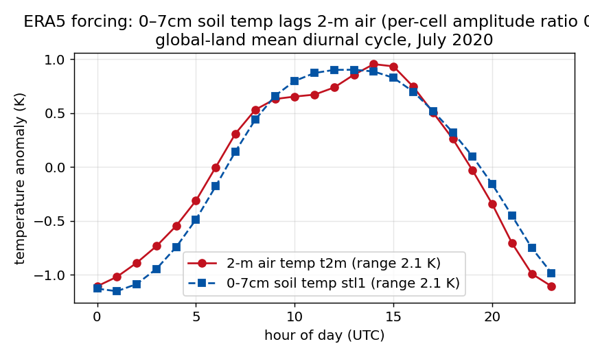
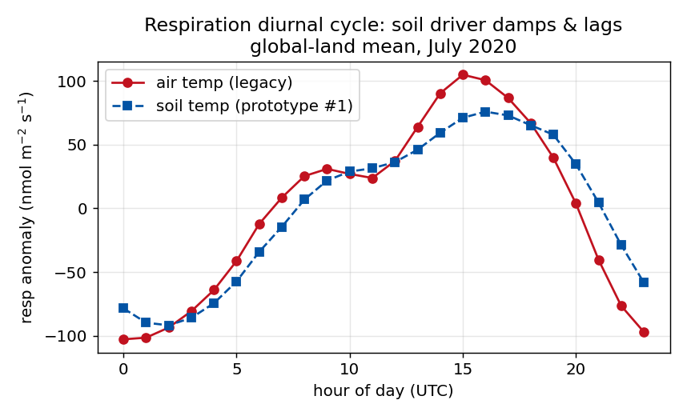
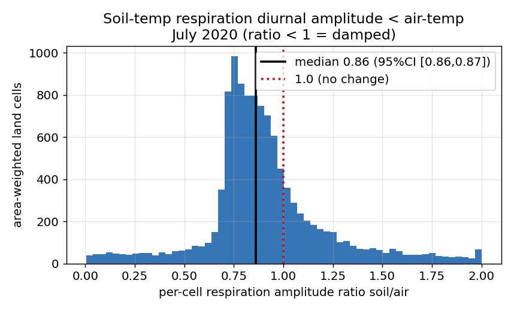

# V1 → V2: a justification for every change

**Status:** decision / review document · **Date:** 2026-06-21 · **Purpose:** a
single auditable register that defends *every* change from the V1 (legacy)
processing pipeline to V2 (`main`, tagged `v2.0.0`). For any change a reviewer
questions, this document gives the rationale, the quantified impact, and the
verification that backs it.

> **Decision requested:** sign-off to make **soil temperature the default
> respiration driver** (§2). Everything else here is already shipped and verified —
> it is backup for any change you want to audit, not an open question.

**This document is self-contained** — the
load-bearing scorecard, equations, figures, and references are inlined here; the
repo docs (`FITTER_COMPARISON.md`, `DIURNALIZATION_ALTERNATIVES.md`,
`METHODOLOGY.md`, `PROPOSALS.md`, `CHANGELOG.md`) hold the fuller bake-offs and
dated logs but are not needed to follow the argument below.

## Executive summary

- **Every V1→V2 change is either a proven no-op or a quantified improvement.**
  Behaviour-preserving changes are verified bit-identical / exact-equivalent; the
  few that move numbers each carry a measured impact + a physical or statistical
  justification + a guarding check (§0, §4).
- **The fitter switch (PIQS → PCHIP) cannot move the science signal.** Every
  fitter is integral-preserving, so for a *pure fitter swap* the monthly-and-longer
  budget — annual totals, trend, interannual variability, ENSO/COVID — is
  **identical by construction** (the deductive guarantee, with the measured PCHIP
  values, is in §0). PCHIP only changes the **sub-monthly shape**, and there it
  fixes PIQS's two disqualifiers: wrong-sign overshoot (**~11% → ≤0.9%** of GPP
  cell-hours) and a global solve that **rewrites the entire ~303-month record on
  every near-real-time (NRT) revision (→ 0 for PCHIP)** (§1, scorecard).
- **"PIQS-then-revert-to-linear" was evaluated and is dominated** — despite a real
  motivation (PIQS's near-C¹ flux — continuous *slope* — which PCHIP gives up; PCHIP
  keeps only C⁰, continuous *value*). It does *not* fix the
  non-locality (still rewrites the record), injects a genuine discontinuity (**0.97
  mol m⁻² s⁻¹** absolute budget vs PCHIP's exact **0**), and only *ties* PCHIP on
  daily fidelity — and PIQS's smoothness edge never reaches the ERA5-redistributed
  hourly prior anyway (§5.1).
- **The diurnalization is V1's, unchanged — but we recommend one flip.** Drive
  respiration off **soil** temperature rather than 2-m air: physically correct
  (soil decomposition responds to soil T, not air), small and sign-correct at the
  NEE level (full-year 2019 diurnal-amplitude ratio **+2.3%, 95% CI [1.021, 1.024]**
  by spatial block bootstrap — all 12 months exclude 1), and free (the soil field
  is already loaded). The one outstanding gate is eddy-covariance amplitude
  validation. Lloyd-Taylor stays opt-in. **Awaiting your sign-off** (§2).
- **Standing verification base:** `verify_v2` (60 checks, 2026-06-21: §§1–23 all
  **PASS or INFO**; the one WARN (11.1) was stale diagnostic crash-logs, since
  **root-fixed + archived** (§6); the §24 FAIL is a manifest logging artifact; and
  the §20 cross-product checks are **deferred/not-yet-run** — §6) + `tests/` (153 on
  Orion; 143 reproduced green
  locally, 10 `quadprog`-gated) + committed diagnostic scripts and figures (§6).

## 0. How to read this — two categories and one invariant

Every change is exactly one of:

- **(B) Behavior-preserving** — the output product is *provably unchanged*:
  bit-identical (`ncdiff` max |Δ| = 0), an exact-equivalent algorithm (matched to
  floating point), or purely additive metadata / observability / packaging.
  These need no *scientific* defense because they move no number the science
  sees; the defense is the verification that proves it (§4).
- **(A) Intentional improvement** — output numbers *do* change. Each carries:
  what V1 did and why it was worse, what V2 does, the quantified impact, why the
  new behavior is correct (physics / statistics / citation), the verification
  guarding it, and the residual risk (§1–§3).

**The master invariant (why the headline change is safe).** Every fitter in the
tree is **integral-preserving by construction**: each month's per-piece integral
equals that month's MiCASA mean. Therefore *the monthly-and-longer carbon budget
— annual totals, the long-term trend, interannual variability, the ENSO and
COVID signals — is identical across any two fitters* **at the fit level**. Two
scope caveats:
- This is a property of the *fitter*. The **shipped** hourly NEE additionally
  applies a polar-night clip (§3.2) that zeros GPP in dark hours and so opens a
  **≤1.5% high-latitude mass gap** in the product — a property of the clip, not
  the fitter, and identical PIQS↔PCHIP. So "mass-preserving" is exact for the
  fit and ≤1.5%-approximate for the delivered product at high latitudes.
- Mass-preservation is exact; **sign-preservation is not** (see §1, claim 2) —
  the two are independent.

The fitter can only change the **sub-monthly shape**. The budget invariance rests
on two legs, stated to their exact epistemic status:
- **Deductive:** verify_v2 Check 2.1 confirms each fitter preserves the per-piece
  integral (max-abs < 1e-9, max-rel < 1e-6). Equal monthly means ⇒ equal
  monthly-and-longer budget. The PIQS↔PCHIP equality of the **verify_v2 §15**
  (trend/ENSO/COVID) signals is
  therefore a *consequence of this invariant*, **argued, not separately
  diffed** — we report it as a guarantee, not a measurement.
- **Measured (PCHIP only):** the Section-15 values — trend +0.0447 PgC/yr/yr,
  2015-16 El Niño +0.643, 2020 COVID −0.346 — were **reproduced** by the 2026-06-21
  verify_v2 re-run, identical to the original 2026-05-04 PCHIP values (§6). These
  are single-product numbers; the standalone PIQS budget was not separately run
  through Section 15 (a full-record PIQS product now exists — `MiCASA_v1_piqs` —
  so a direct diff is possible and is the cleanest future confirmation).

So the change Andy flagged does not move the science signal — it changes the
sub-monthly shape, removing most of an unphysical artifact.

**Standing evidence base.** Two independent harnesses back the claims below:
- `verify_v2` — **60 numbered checks across 24 sections** (enumerated in §6; the
  summary shows 62 status lines = 51 PASS / 1 WARN / 9 INFO / 1 FAIL, because Check
  2.1 splits into `2.1.gpp`/`2.1.rtot` and a `P2.0` build-cube line is also logged),
  committed at
  `fitter_diagnostics/verify_v2_summary_20260621.txt`
  (**51 PASS / 1 WARN / 9 INFO / 1 FAIL** — the single FAIL is Check 24.1, explained
  below). **All science / product / provenance checks (§§1–23) PASS and reproduce
  the numbers used below.** The two **§24 items are
  manifest / observability meta-checks on a shared working-directory log — not
  assertions about the product.** That run's lone FAIL was Check 24.1
  (run-manifest integrity): **concurrent-append corruption** of `jobs/run_manifest.tsv`
  — interleaved/partial writes from many parallel jobs — a pure logging artifact, as
  Check 24.2 ("no failed pipeline steps") **PASSED** in the same run. We
  **losslessly recovered** the log (split the merged records, dropped the empty
  lines; a re-parse then shows 0 rows ≠ 7 columns — exactly Check 24.1's criterion;
  not committed, as the manifest is a gitignored runtime artifact). We deliberately
  do **not** post a fresh re-run tally: this session's
  *separate* isolated PIQS-release builds have since written to the same shared
  `jobs/` logs that §3.1/§24 read, so a re-run would reflect that unrelated activity
  rather than the shipped product. The clean PCHIP-product numbers below are from
  the committed summary.
- `tests/` — **143 R checks run on any host (10 files) + 10 `quadprog`-gated
  (`test_mss_fit.r`, Orion only) = 153**, plus 4 Python suites; **all green** on
  Orion (R 4.4.0, 2026-06-21). The 143 non-gated R checks were reproduced green
  locally (R 4.6.0) for this revision. Per-change → test map in §6.

---

## 1. Headline change — fitter PIQS → PCHIP (A)

This is the change that prompted the V1↔V2 concern, so it gets the fullest
defense — the decisive comparison is the scorecard and constraint trilemma below.
(The fuller per-method bake-off, incl. PPM / minmod / MSS / ATP-kriging, is in the
repo's `FITTER_COMPARISON.md`, but is not needed to follow this section.)

**V1 — PIQS** (Piecewise Integral Quadratic Splines, Rasmussen 1991;
CT2022-documented). Per-cell quadratic pieces, each preserving the monthly
integral, C⁰ at knots. Two disqualifying problems for an NRT product:
1. **Overshoot → unphysical sign flips.** In sharply seasonal cells the quadratic
   overshoots through zero, producing positive (source) GPP and negative
   respiration sub-monthly. Measured rate on a regenerated PIQS fit
   (`fitter_diagnostics/piqs_score.r`, full 2001–2026 record): **6.55%** of GPP
   cell-hours mean, **14.70%** max (the per-month max is ~11% on the 2020 product);
   Rh 0.122% / 0.444%. (The PCHIP product's own Check 3.1 is the 0.11%/0.94% below.)
2. **Non-locality.** PIQS is a single global solve over the entire record, so any
   NRT revision **rewrites all 303 historical months** — the published past
   changes every cycle.

**V2 — PCHIP-on-cumulative** (Fritsch & Carlson 1980; `splinefun(method="monoH.FC")`
/ `scipy PchipInterpolator`). Monotone-cubic Hermite interpolation of the
cumulative integral F(t), differentiated analytically to the flux f = F′ as a
piecewise quadratic (same `(a,b,c)` storage as PIQS).

### Equations

Both fitters store, per cell and month *i*, a quadratic on `t ∈ [tᵢ, tᵢ₊₁]` of
width `hᵢ`, and both impose **mass preservation** — the piece integral equals the
MiCASA monthly mean `ȳᵢ` (this *is* the master invariant of §0):

```
fᵢ(t) = aᵢ (t−tᵢ)² + bᵢ (t−tᵢ) + cᵢ
(1/hᵢ) ∫[tᵢ→tᵢ₊₁] fᵢ dt = aᵢhᵢ²/3 + bᵢhᵢ/2 + cᵢ = ȳᵢ
```

**PIQS** (Rasmussen 1991) fixes the remaining freedom by a **single global solve**:
each piece preserves its integral *and* adjacent pieces share the knot value (C⁰),
`fᵢ(tᵢ₊₁) = fᵢ₊₁(tᵢ₊₁)`. That continuity system couples *every* month to every
other → non-local; nothing constrains the quadratic's sign, so it overshoots
through zero in sharply seasonal cells.

**PCHIP-on-cumulative** (Fritsch & Carlson 1980; `lib/pchip_fit.r`) instead works
on the cumulative integral and is **local**:

```
Fₖ = Σ_{i<k} ȳᵢ hᵢ           (F₀ = 0; monotone when the ȳᵢ share a sign)
secants     mₖ = ȳₖ
F-C knot slopes dₖ:  dₖ = 0 at a secant sign change,
                     else |dₖ| ≤ 3·min(|mₖ₋₁|, |mₖ|)   ← monotonicity limiter
```

The flux is the derivative of the monotone cubic Hermite on `F`; on segment *k*
with `s = (t−xₖ)/hₖ`,

```
f(s) = (6s−6s²)·mₖ + (3s²−4s+1)·dₖ + (3s²−2s)·dₖ₊₁
```

which in the stored `(a,b,c)` form is, with `Q = −6mₖ+3dₖ+3dₖ₊₁`,
`L = 6mₖ−4dₖ−2dₖ₊₁`, `K = dₖ`:

```
aᵢ = Q/hₖ²,   bᵢ = L/hₖ,   cᵢ = K          (signs negated for GPP ≤ 0)
```

Mass is automatic (`∫₀¹ f ds = mₖ = ȳₖ`). **The contrast in one line:** PIQS sets
`(a,b,c)` by a *global* C⁰ system (→ non-local, sign-unconstrained → overshoot);
PCHIP sets them from *local* Fritsch-Carlson knot slopes `dₖ` (→ ~1-month
revision footprint, sign-definite *at the knots* by the limiter). Both yield the
identical `ȳᵢ` — hence the budget-invariance (§0).

### The constraint trilemma — why every fitter relaxes *something*

For interval-mean reconstruction there is a **well-established practical tension**
— documented in Bartlein's *mp-interp* notes, the JULES temporal-interpolation
docs, and the smoothing-spline literature, though **not as a single named
theorem** — between **exact mass, strict no-overshoot, and global smoothness**: a
mean-preserving *smooth* fit tends to overshoot near sharp turning points, and
forcing strict no-overshoot tends to break smoothness or continuity there. It is a
strong empirical regularity, not a proof, and the axis that gives is *strict*
boundedness: tolerating a small **bounded** overshoot (no sign flip) buys back
mass, continuity, smoothness, *and* locality together. Every method keeps mass and
relaxes one axis — *which* one is the whole argument:

| Method | mass | relaxes | keeps |
|---|---|---|---|
| **PIQS (V1)** | ✓ | **boundedness** — overshoots, incl. wrong-sign, *unbounded* | global smoothness, C⁰ |
| **PCHIP (V2)** | ✓ | strict boundedness → a **bounded ≤1.5×** bump | C⁰ flux, sign-definite at knots, **local** |
| Rymes–Myers (bounded-iterative) | ✓ | strict boundedness → bounded ≤1.45× bump (**same axis as PCHIP**) | sign-**definite**, C⁰, smooth, **local** — competitive (`FITTER_COMPARISON.md` §2.6); not default (iterative, no closed form, emits point values not native `(a,b,c)`) |
| PPM | ✓ | **global continuity** (small jumps at ~70% of edges) | no overshoot, smooth |
| minmod-linear | ✓ | **continuity + curvature** | no overshoot |
| PIQS + linear-fallback | ✓ | **continuity** (large jumps where it patches) — **and keeps PIQS's non-locality** | no overshoot |

Three requirements are **non-negotiable** for a CO₂-inversion NRT prior:
**(1) mass conservation, (2) no wrong-sign flux** (GPP must not be a source),
**(3) NRT stability** (a revised recent month must not rewrite the published
record). PIQS fails (2) and (3); the linear-fallback fails (3) and breaks
continuity hard (§5.1); PCHIP meets all three, at the cost of only a bounded,
physically-real sub-monthly bump (MiCASA's own daily data exceeds the monthly-mean
envelope routinely, so a peak above it is real, not an artifact). That is the
whole fitter case in one table. **PCHIP is not the *only* fit that reaches this
corner:** the bounded-iterative Rymes–Myers scheme keeps mass, sign, continuity,
smoothness *and* locality too — relaxing the same strict-boundedness axis as PCHIP
(`FITTER_COMPARISON.md` §2.6, measured 2026-06-18). PCHIP is the default over it on **engineering** grounds, not a
trilemma one: PCHIP is closed-form and emits the native `(a,b,c)` quadratic
directly, whereas Rymes–Myers is iterative (no closed form, a `niter` to tune) and
produces point values that would need a fit/convert step in `diurnalize`. So the
table makes a *decisive* case against PIQS and the linear fallback, and an
implementation-broken tie for PCHIP over Rymes–Myers.

**Claims, stated to their exact scope:**
1. **Budget-invariant at the fit level** — monthly+ means identical by
   construction (each piece's integral = the monthly mean; mass-preserving). The
   climate signal is therefore fitter-invariant (master invariant above; Check
   2.1, Section 15). Globals unchanged: GPP ∈ [−126.2, −119.8], resp ∈
   [117.0, 123.9] PgC/yr (Check 5.1; reproduced 2026-06-21). The PCHIP↔PIQS
   equality of these globals is by the integral-preserving invariant (§0), argued
   not separately diffed.
2. **A large sub-monthly improvement — a ~16–60× reduction in sign flips, *not*
   elimination by construction.** PCHIP fits a Fritsch-Carlson *monotone* cubic to
   the cumulative integral, so the flux f = F′ is sign-definite **at the knots**
   and overwhelmingly so in the interiors. It is **not** sign-definite *everywhere*
   by construction: Fritsch-Carlson constrains the cubic's *knot* slopes, and the
   derivative quadratic can still dip mid-segment even on strictly single-signed
   input. We reproduced this — worst interior flux **−0.042 on strictly positive
   monthly means** (0.1% of 20,000 synthetic series carry any wrong-sign dip), see
   [`fitter_diagnostics/pchip_sign_definiteness.r`](../fitter_diagnostics/pchip_sign_definiteness.r)
   and its committed output `pchip_sign_definiteness_20260621.txt`.
   What PCHIP buys is a 1–2 order-of-magnitude *reduction* vs PIQS, leaving a small
   bounded residual: GPP **6.55% → 0.11%** mean (~60×), 14.70% → **0.94%** max
   (16×); Rh 0.122% → 0.0000% mean, 0.444% → 0.002% max (Check 3.1,
   `verify_v2_summary_20260621.txt`). Check 18.2 confirms **C⁰ flux continuity**
   (flux-value |jump| ≤ 1e-12 at knots — i.e. C¹ of the cumulative F; PCHIP is *not*
   C¹ in the flux, see §5.1). Check 18.1 (INFO)
   finds **0.646% of GPP *segments*** carry a wrong-sign interior
   point (max 1.24e-6) — a *different* denominator (segments, not cell-hours), so
   consistent in order of magnitude rather than a strict cross-check, but it
   likewise confirms the residual is real and that "sign-definite everywhere" would
   be false.
3. **Reduction is rule-based, not tuned** — the knot-level sign-definiteness and
   the interior reduction come from the Fritsch-Carlson monotonicity rule, not a
   fitted parameter; the small residual interior dips (and any dark-hour GPP) are
   then removed by the polar-night clip (§3.2). PIQS's overshoot, by contrast, was
   an order of magnitude larger and *not* removable without a clip that would
   distort the bulk flux.
4. **NRT-local** — Fritsch-Carlson slopes use only neighbouring monthly means, so
   a revision's footprint is ~1 month, vs PIQS rewriting the whole record. This is
   a correctness requirement for a published NRT product, independent of the
   physics. (Locality follows from the slope formula; it is argued, not separately
   diff-tested.)

**Verification:** Checks 2.1, 3.1, 6.1, 18.1, 18.2; `tests/test_pchip_fit.r`
(12 checks, green); `bakeoff_pchip.py` (6 biome cells: 0% flips *on those cells*
vs PIQS up to 30.91% — the full-grid residual is the ≤0.94% in claim 2, |Δ flux| < 2e-11).

### Empirical scorecard — production fit + full-year 2020 diurnalize (~4.4 M land cell-months)

The trilemma table above is conceptual — *which property* each method sacrifices.
This scorecard is the **measured** version of the same comparison on the production
fit. Throughout, **env** = the local monthly-mean flux magnitude (the natural scale
for normalizing a sub-monthly excursion).

| Metric | PIQS (V1) | **PCHIP (V2)** | PPM | minmod | PIQS+lin-fallback |
|---|---|---|---|---|---|
| Mass-conserving | ✓ | ✓ | ✓ | ✓ | ✓ |
| Overshoot peak/env (med / max) | 0.93 / **~10¹⁸** (diverges, see ²) | 0.83 / **1.50** | 0.78 / 1.00 | – / 1.00 | – / 1.00 |
| GPP wrong-sign (cell-hours, max month) | **~11%** (2020) | **0.1–0.9%** | 0% | 0% | 0% |
| Daily-fidelity RMSE/env, GPP (**median**) ² | 0.086 | **0.081** | 0.079 | 0.094 | 0.079 |
| Flux continuity (jump/env med ; % edges) | C⁰ | **0 ; 0%** | 0.018 ; ~70% | 0.10 ; ~93% | **0.25⁴ ; 29%** |
| **NRT footprint** (months rewritten, +10% revision)³ | **all 303** | **0** | ≤2 | ≤1 | **all 303** |
| Lineage | Rasmussen 1991 | Fritsch-Carlson 1980 | Colella-Woodward 1984 | van Leer 1979 | — |

² We report the **median** RMSE/env because the *mean* is tail-sensitive: PIQS's
GPP mean is **18.6**, wrecked by cells where the global solve diverges to ~10¹⁸× the
envelope (28% of GPP cell-months carry a wrong-sign knot), and even the local
methods' means (PCHIP 0.151 / PPM 0.149 / minmod 0.159; committed in
`fitter_diagnostics/uncertainty_fidelity_20260621.txt`) are noisier than their
medians. On the robust median all local methods sit within ~0.015, and **PIQS's own
median (0.086) is fine** — its disqualifiers are the overshoot tail and
non-locality, not median fidelity. PIQS numbers measured 2026-06-18 on a regenerated
fit, same record/diurnalize (`piqs_score.r`). ³ Perturb the latest monthly mean +10%,
refit, count prior months moving > 1% (PIQS's global solve couples the whole
record). ⁴ The PIQS+lin-fallback continuity entry is the **finite-envelope median**
jump/env (0.25) over the 29% of cell-months that trigger the patch; 38% of patched
edges fall in near-zero-envelope transition months where jump/env is undefined, so
the honest cross-method statement is the **absolute** discontinuity budget — 0.97
mol m⁻² s⁻¹ vs PCHIP's exact 0 (§5.1). **Among the columns shown, PCHIP is the only one that is sign-safe,
C⁰-continuous, *and* NRT-local** — the good corner (see the §5.1 tradeoff scatter).
(The bounded-iterative Rymes–Myers scheme, not tabulated here, also reaches that
corner — see the trilemma note above; PCHIP wins on closed form + native format.)

**Selectable alternatives** (not defaults): PPM, minmod/MUSCL, ATP-kriging, MSS,
PIQS all remain selectable via `MICASA_FIT_RDA`; PPM was briefly defaulted then
reverted (continuity — see §5). The on-disk format and all monthly+ budgets are
identical across them.

---

## 2. Diurnalization — framework unchanged; refinements staged but not yet shipped

**The production diurnal scheme is V1's, unchanged.** GPP ∝ ERA5 shortwave,
respiration ∝ Q10(2-m air temp) — Olsen & Randerson (2004). There is **no V1→V2
change to the default diurnal cycle**, so nothing here needs defending against V1.

The soil-temperature driver and Lloyd-Taylor response documented in
[DIURNALIZATION_ALTERNATIVES.md](DIURNALIZATION_ALTERNATIVES.md) are **default-off,
opt-in** (`MICASA_RESP_DRIVER`, `MICASA_RESP_TEMPFUN`) and **byte-identical to
the canonical product when off** — verified by a committed `ncdiff` run
([`fitter_diagnostics/bytecheck_resp_driver_default.txt`](../fitter_diagnostics/bytecheck_resp_driver_default.txt):
max |Δ| = 0 for GPP/resp/NEE, new default-path code vs the canonical
`ERA5_2020_pchip/fluxes_202007.nc`), run-and-diffed, not argued from source. They
are evidence-backed *candidates*, not shipped
changes; defaults will not move without explicit sign-off (the recommendation, and
the one validation gate still open, are below). So they impose zero risk on the
current product while making the next step defensible. (Measured effect when enabled: soil-temp NEE diurnal amplitude
+2% global, ×0.5 boreal winter; Lloyd-Taylor respiration ×1.5 global — see that
doc §5.1–5.3.)

**Recommendation (new — full-year 2019, spatial block-bootstrap CIs):** we
recommend soil temperature as the default respiration driver, with **one explicit
outstanding gate** (eddy-covariance amplitude validation, below). The case has
three legs, measured on the matched full-year-2019 PCHIP air-vs-soil pair (all 12
months; script `fitter_diagnostics/resp_driver_blockboot.py`, committed output
`fitter_diagnostics/resp_driver_blockboot_2019.txt`):

- **The NEE effect is small but robustly non-zero.** The global area-weighted NEE
  diurnal-amplitude ratio soil/air is **1.023, 95% CI [1.021, 1.024]** by a
  *spatial block bootstrap* — the resampling unit is a 10° block, so the interval
  reflects the field's spatial autocorrelation rather than treating ~15.6k
  correlated land cells as independent. It survives a conservative 20°-block CI
  [1.020, 1.025], and **every one of the 12 months excludes 1 individually**
  (range 1.016–1.027) — a consistent all-season effect, not a single-month
  artifact. *(The 10° block respects spatial autocorrelation; a naive i.i.d.-cell
  resample would give a ~16×-tighter, invalid CI — [1.0225, 1.0228] — by treating
  ~15.6k correlated cells as independent.)*
- **Respiration is materially damped, most where air temp is least physical.** The
  respiration amplitude ratio soil/air is **0.80, 95% CI [0.78, 0.83]** (10° block,
  annual), pulled down by the **boreal band 0.61 [0.58, 0.63]** — snow-insulated or
  frozen soil decoupled from swinging winter air, exactly where the air-temp proxy
  is worst. (SH-temperate 0.94 [0.86, 1.07] is the one band whose CI spans 1.)
- **It is physically motivated and free.** Soil decomposition responds to soil, not
  air, temperature (Lloyd & Taylor 1994); `stl1` is already loaded; mass is
  conserved and the default-off path is byte-identical (§2 above).

**What is *not* claimed.** The respiration amplitude ratio necessarily tracks the
driver's own `stl1`/`t2m` amplitude ratio — respiration is a monotone function of
its temperature driver — so that self-consistency confirms the implementation uses
soil temperature; it is **not** independent evidence that soil temperature is the
*correct* driver. That last step is what an **eddy-covariance diurnal-amplitude
check** settles, and it is the one gate still open. The production default is
therefore **not** flipped: we seek sign-off either to (a) adopt soil-temp once EC
confirms, or (b) treat the EC check as confirmatory and adopt now, given the
physics and the all-season robustness above. **Lloyd-Taylor** (the alternative
temperature-response *function*, orthogonal to the driver choice) stays opt-in: it
swings respiration amplitude 1.5–3.7× but moves NEE only ~1% outside boreal winter,
and its steep low-temperature sensitivity is the uncertain piece — flip it only
after the same EC check.







---

## 3. Other product-number changes (A) — each justified

### 3.1 Aggregation latitude-weight bug fix — V1 was wrong, V2 is correct
V1's 0.1°→1° aggregator (`lib/ingest_common.r:aggregate.to.1x1`) recycled the
cos-latitude area weights **column-major**, applying them along the *longitude*
axis instead of latitude (with a dead ×10/÷10 inner loop). V2 builds a flat
length-100 weight vector that assigns each sub-cell its correct latitude weight.
This is a **genuine bug**: V1 area-weighted the wrong axis. Impact is small for
smooth fields (typically < 0.01%) and grows toward the poles where the cos-lat
gradient across a 1° block is largest. **Verification:** `tests/test_aggregate.r`
(regression test) pins the corrected weighting against the analytic spherical
area; `lib/test_ingest_bitident.r` confirms the read path. Justification is not
"we prefer V2" but "V1 mis-weighted; V2 matches the analytic cos-lat area."

### 3.2 Polar-night GPP = 0 clip
Physical: no incoming shortwave ⇒ no photosynthesis. The clip zeros GPP wherever
`ssrd == 0`, removing the small residual the sub-monthly quadratic otherwise
leaks into dark hours (a spot check of `fluxes_202512.nc`: ~2.6% of cells touched,
max |GPP| = 9.4e-9 mol m⁻² s⁻¹ — illustrative, not a verify_v2 check; Check 12.2
verifies >75 N GPP = 0). Cost: a ~1.5% mass-conservation gap at partial-polar-night
latitudes (Check 2.2 threshold relaxed 1% → 5% to acknowledge it) — this gap is
the reason the shipped product is not exactly mass-preserving (§0). Under PCHIP
this clip is now **largely redundant** — the fit's residual interior dips are
small (≤0.94% of GPP cell-hours, §1), so the clip's remaining effect is minor —
but kept as defense-in-depth. **Verification:** Checks 12.2, 17.1.

### 3.3 ERA5 dual-tree FastTrack fallback
Only affects NRT trailing months the primary ERA5 tree has not yet populated;
those days fall to the lower-latency `ea_0005` FastTrack stream (the *same* ERA5
product, earlier release). For any month the primary covers, the path is
unchanged. Per-day provenance is written (`meteo_source_by_day`, e.g.
`primary:1-30 fasttrack:31`). **Verification:** Checks 1.4, 10.1; first
production use 2026-Q1 (2026-02/03 wholly FastTrack), clean files.

### 3.4 Per-month climatology auto-detect
V1 chose real-vs-climatology per *year* from a hand-set `MICASA_CLIM_YEARS` list,
with no file-existence check — a partially-published year forced either
climatologising real months or crashing on unpublished ones. V2 decides per
*month* by file presence: real monthly file present ⇒ use it, else day-of-year
climatology. For fully-published months the path is identical. **Verification:**
Check 1.4; 2026-Q1 run (Jan–Mar real via PCHIP, later months climatology, no
crash).

---

## 4. Behavior-preserving changes (B) — proven no-ops on the product

Each item below changes *no flux value*; the proof is in the right column.

| Change | Proof it preserves the product |
|---|---|
| `diurnal.flux` / `polar.night.clip` extracted to `lib/diurnal.r` | Byte-for-byte identical on random arrays; `tests/test_diurnal.r` (21) |
| Fitter cores extracted to `lib/{pchip,mss,ppm,linmm}_fit.r` | Function bodies unchanged; unit tests `test_{pchip,mss,ppm,linmm}_fit.r` (12/10/13/11) |
| ERA5 path helpers → `lib/era5_meteo.r` | `tests/test_era5_meteo.r` (11) on resolver + run-length encoder |
| Grid-area fns `archimedes`/`compute.gca` made pure | `tests/test_ingest_geometry.r` (20) vs analytic 4πR² |
| `compute_clim` PyFerret → xarray | Algorithm exact to 1e-12 vs hand-computed mean; `tests/test_compute_clim.py` |
| `check_bounds` NCO `ncwa` → xarray | Pure `flux_to_tgc_per_year`; `tests/test_check_bounds.py` (7). NCO version never actually ran (guarded by `|| true`). |
| Ingest skip-existing + read-only-needed | `ncdiff` 4 days × 4 tracers max \|Δ\| = 0; `lib/test_ingest_bitident.r`; 610→504→4 s |
| Compression deflate 9 → 4 (**diurnalize output only**; ingest stays at 9, `lib/ingest_common.r:149`) | Lossless codec ⇒ data bit-identical; only size +0.3% / time −39% (`lib/bench_compression_diurnal.r`). Codec argument, not ncdiff-run. |
| Provenance CF/ACDD attributes | Additive global attributes only; `tests/test_provenance.{r,py}` (26 ea); Checks 23.1–23.3 |
| Per-step run manifest | Additive `jobs/run_manifest.tsv`; never aborts caller; `tests/test_manifest.r` (15); Checks 22.1, 24.1–24.2 |
| Sub-monthly sign-flip logging | Log lines only; drives Check 3.1; no flux touched |
| Download verify scoped to year | Verifies *which* files, not their content; same files for a given year |
| Op bug fixes: `sbatch_wait` comma, `check_hashes` glob, `compute_daily_clim` nullglob, hardcoded paths | Fix crashes/skips, not numbers; `tests/test_check_hashes.py` (12); 2026-Q1 multi-scenario run |
| verify_v2 harness edits (6.2→INFO, 11.1 log-age, 5.1/5.2 partial-year, 1.4 dual-tree) | Change what is *checked*, not what is *produced*; each justified in CHANGELOG 2026-05-16 |
| Public-release packaging (LICENSE CC0, README split, CITATION.cff, CI) | No pipeline effect |

The CI (`.github/workflows/ci.yml`) byte-compiles Python, `bash -n`s every shell
script, `parse()`s every R script, and runs the behavior tests on every push — so
these refactors cannot silently regress.

---

## 5. Considered and rejected (diligence, not changes)

Documenting what was *not* changed, and why, is part of the justification:

- **ATMC budget closure (NEE = Rh − NPP, *not* − ATMC)** — tried 2026-04-29,
  reverted same day. This is the most consequential "rejected" choice — it changes
  the sign of the prior's long-term trend — so it gets its own treatment in **§5.2**.
- **PPM as default** — briefly defaulted 2026-06-18, reverted: daily fidelity is
  near-identical (a by-cell bootstrap puts PCHIP negligibly but *significantly* ahead,
  Δ≈0.7% of level, CI excludes 0; PPM better in 54% of cell-months on the pooled
  metric) but PPM reintroduces month-edge discontinuities at ~70% of edges
  (CHANGELOG 2026-06-18; FITTER_COMPARISON §4.6).
- **MSS** (overshoots despite the name, ~24% wrong-sign GPP knots, ~hours/grid),
  **linear-recursion PIQS** (unstable), **constrained-quadratic PIQS** (dominated
  by PCHIP), **CCGCRV** (not pursued) — FITTER_COMPARISON.md §4.1/§5, PROPOSALS
  #9/#11/#6.

---

### 5.1 Why not "PIQS, then revert to linear on overshoot"

This hybrid — keep PIQS's smooth global-solve quadratic where it is sign-safe and
patch **only** the overshooting pieces with a sign-safe integral-preserving linear
— was the stakeholder-preferred alternative to PCHIP, and it has a **genuine
motivation we state plainly**: PIQS's global solve makes its flux **near-C¹**
(continuous *slope*), whereas PCHIP-on-cumulative is only **C⁰ in the flux** — the
flux carries a small slope kink at each month knot. Measured
(`FITTER_COMPARISON.md` §4.5): the knot derivative-jump (×width/env) is **PIQS
0.000 vs PCHIP 0.290**. A *selective* fallback would therefore keep PIQS's superior
derivative-smoothness on the ~71% of sign-safe pieces and patch only the rest. That
is the strongest case for it, and it is real.

We implemented and measured it (`fitter_diagnostics/piqs_hybrid.r`,
`linear_fallback_quantify.r`; committed output
`linear_fallback_quantify_20260621.txt`) and **did not adopt** it, because that C¹
advantage is inconsequential for *this* product and is outweighed on locality and
continuity:

0. **The C¹ edge does not reach the delivered prior.** The shipped hourly NEE is
   the fit's monthly mean redistributed by ERA5 hourly meteo; the smoother sets
   only the small within-month *deviation* term, and the hourly field is sampled,
   not differentiated. A C⁰-vs-C¹ distinction in the flux *slope* at month knots is
   below the ERA5 redistribution it rides on — which is exactly why the daily
   fidelity is a tie (point 3). The smoothness PIQS preserves is aesthetic here,
   not a measurable property of the prior.
1. **Non-locality is not fixed.** The linear fallback is applied *post-hoc* to
   PIQS's already-solved coefficients; it does not decouple the knots. A revised
   NRT month still re-solves PIQS and **rewrites all 303 historical months**
   (the **NRT footprint** row of the §1 scorecard) — the exact disqualifier PCHIP
   avoids (footprint 0). This applies to the *selective* fallback, i.e. Andy's
   actual proposal, not a strawman.
2. **It injects a genuine discontinuity where PCHIP injects none — reported
   denominator-free.** **29.3%** of land cell-months trigger the fallback, and
   patching breaks PIQS's C⁰ continuity there. The honest, denominator-free
   statement: the hybrid's **total absolute discontinuity budget is 0.97 mol m⁻²
   s⁻¹** summed over 1.44 M patched land edges, versus **exactly 0** for PCHIP (C⁰
   by construction). An envelope-normalized framing (“52% exceed 3× env”) is
   misleading here: the overshooting pieces are near-zero-transition months, so
   **38% of patched edges have envelope ≈ 0**, where “jump/env” blows up by dividing
   by ~0, not by being physically large (among the 62% of edges with a well-defined
   envelope the median jump is only **0.25× env**). The absolute budget is the
   defensible cross-method number.
3. **No fidelity gain.** On the robust **median**, hybrid daily RMSE/env (2020) is
   **0.079** vs PCHIP's **0.081** — a tie; the means (0.139 vs 0.151) are
   tail-sensitive and not a meaningful difference. The preserved smoothness buys no
   reconstruction accuracy, consistent with point 0.

(*A distinct, weaker proposal — “use continuous linear **everywhere**”, PROPOSALS
#9, which is **not** the selective fallback above — is worse than PIQS on its own
terms: the recursion `yᵢ₊₁ = 2·mᵢ − yᵢ` flips sign at 36.9% of interior knots and
rings with unbounded resonance (knot/env p99 ≈ 2.6×10⁵, a Nyquist pole). We note it
only to close the option; it is not Andy's proposal.*)

So against the *selective* fallback, PCHIP wins on locality and continuity while
conceding a real but immaterial C¹-flux advantage; it is sign-safe *and*
C⁰-continuous *and* local *and* closed-form — the "good corner" below:


### 5.2 ATMC, and the sign of the prior's long-term trend

This is the choice most likely to be contested.

**What ATMC is.** NCCS publishes an "atmospheric correction" `ATMC` field with the
file comment `NEE = Rh − NPP − ATMC`. Per Weir et al. (2021) it is the Low-order
Flux Inversion (LoFI) empirical sink, `S_m = α_yr·max(T_m−T_{m-1},0)/10·HR_m`, with
α scaled **each year so the global biospheric total matches the observed
atmospheric CO₂ growth rate** (~3 PgC/yr, concentrated NH-extratropics JJA).

**The stakes are not cosmetic — and they hit both the level and the trend.**
Subtracting ATMC more than *doubles the mean biospheric sink*, from **−2.45 to
−5.99 PgC/yr** (a 3.5 PgC/yr shift; the ATMC field itself is ~3 PgC/yr), and *flips the sign of the long-term
trend*: CASA-only NEE trends **+0.0413 PgC/yr/yr**, with ATMC **−0.0067** (i.e.
essentially flat). The trend alone compounds to ≈ **+1.1 PgC/yr** of drift over the
25-yr record — itself of order the mean sink. So ATMC is a first-order change to
both the magnitude and the time-evolution of the prior, not a rounding term.

**Why we still do not subtract it — and this holds whether the trend is real or a
CASA bias.** These fluxes are a **prior to a CO₂ inversion that itself assimilates
atmospheric CO₂**, and ATMC was tuned to *that same observation class* (the global
growth rate). Subtracting it pre-loads the prior with the very constraint the
inversion exists to apply — **data leakage / double-dipping** — after which the
inversion can no longer *independently* constrain the long-term sink, because the
answer is already baked in. The growth-rate constraint belongs in the inversion's
assimilation step, applied once, against a prior that reports what the offline
biosphere model says **on its own**. Crucially this argument does **not** require
us to claim the +0.0447 trend is physically correct:
- *If* it is real (e.g. CO₂-fertilization / greening strengthening NPP, which CASA
  represents through satellite-APAR forcing — Zhu et al. 2016), the inversion keeps
  it and the data confirm it.
- *If* it is a CASA structural bias (e.g. warming-driven respiration outrunning
  NPP), the inversion corrects it from the atmospheric data.

Either way the prior's job is to carry CASA's *own* estimate; baking in ATMC
forecloses the correction in both cases. So we ship the +0.0447 trend as a property
of the CASA prior — **not** asserting it is a "real climate feature," only that
pre-correcting it would be circular.

**When ATMC *would* be appropriate.** If these fluxes are ever used *outside* an
inversion — forward site-level comparison against obs, or as a fixed ensemble
member with no further optimization — there is no double-dipping and the ATMC
subtraction is the right choice. For the current prior-to-inversion use it is not.
(Trend figures: the **+0.0413** in the 2026-04-29 ATMC table is the *PIQS-era*
CASA-only trend; **+0.0447** is the later *PCHIP* Section-15 value (2026-05-04 run);
**+0.04** elsewhere is the same number rounded — one ~+0.04 PgC/yr/yr trend, three
runs. The +0.0413→+0.0447 difference is between two **different-date pipeline runs**
with other V2 changes intervening — *not* a fitter effect; the budget-invariance of
§0 is a statement about a **pure fitter swap on a fixed pipeline**, which is why we
do not claim the cross-date runs match to floating point.)

## 6. Evidence matrix

**Validation harness — `verify_v2` (60 distinct checks / 24 sections).** Phase 1
structural (1.1–1.4); Phase 2 transformation + sanity (2.1–2.4 mass/integral,
5.1–5.3 global/YoY/seasonal); Phase 3 cross-boundary + spatial-vs-v1 + provenance
(4.1, 6.1–6.2, 7.1–7.4, 8.1–8.3, 9.1–9.2, 10.1, 11.1–11.2); Phase 4 edge cases +
biome cells + trends (12.1–12.2, 13.1–13.2, 14.1–14.3, 15.1–15.3 trend/ENSO/COVID,
16.x diagnostics); Sections 17 diurnal integrity, 18 PCHIP invariants, 19
additional biomes, 20 cross-product, 21 robustness, 22 performance, 23 provenance,
24 manifest (§24 = observability meta-checks on the run log, *not* product
assertions). Committed run `verify_v2_summary_20260621.txt` (**51 PASS / 1 WARN /
9 INFO / 1 FAIL**); the lone FAIL is Check 24.1 — concurrent-append corruption of the shared
`run_manifest.tsv`, a logging artifact (Check 24.2 "no failed steps" PASSED in the
same run). The log was then **losslessly recovered** (0 malformed rows remain —
Check 24.1's exact criterion). All §§1–23 product / science / provenance checks
pass. (We don't post a fresh re-run: this session's separate isolated PIQS-release
builds have since written to the shared `jobs/` logs §3.1/§24 read — see §0.)

The run's single **WARN (Check 11.1, job-log error scan)** was likewise a
logging-hygiene item, now resolved. It flagged 10 recent `jobs/*.o*` logs containing
"Execution halted": superseded one-off **diagnostic** crashes — the ATP-kriging
fitter (`write_atpk.r`, a *non-default selectable* option) hitting a singular
kriging system on dormant / near-zero-variance cells (e.g. boreal +71.5). **The
production fitter already guards this** — `lib/atpk_fit.r` does `solve` → ridge-
regularized `solve` → a flat **dormant** fallback, never halting — and that path is
unit-tested (`tests/test_atpk_fit.r` dormant-cell checks) and live-verified (a
singular-inducing cell returns `dormant=TRUE`, no error). Those stale crash logs
plus a few self-referential verify-run logs (whose names slipped past the scan's
`verify*` self-exclusion) were archived to `jobs/archive/`, and the exclusion was
widened to match "verify" anywhere in the log name (commit `f6439ba`); the scan now
reads **0 flagged** (Check 11.1 → PASS).

**Unit tests — all green on Orion (R 4.4.0 / Python, 2026-06-21); the 143
non-`quadprog` R checks reproduced green locally (R 4.6.0) for this revision:**

| Suite | Checks | Guards |
|---|---|---|
| test_pchip_fit.r | 12 | PCHIP mass / C⁰ flux continuity (= C¹ of F; not C¹ flux) / sign-flip-rate (not sign-definiteness — see §1) |
| test_diurnal.r | 21 | diurnalize transform + q10/lt factors |
| test_atpk_fit.r | 14 | ATP coherence/variance/sign |
| test_ppm_fit.r / test_linmm_fit.r | 13 / 11 | PPM & minmod mass/limiter |
| test_mss_fit.r | 10 | MSS QP fit — **requires `quadprog`; runs on Orion, SKIPs without it** |
| test_ingest_geometry.r | 20 | spherical area weights |
| test_era5_meteo.r | 11 | FastTrack resolver |
| test_manifest.r | 15 | manifest format / no-abort |
| test_provenance.r / .py | 26 / 26 | CF/ACDD attributes |
| test_check_hashes.py / test_check_bounds.py / test_compute_clim.py | 12 / 7 / 10 | hashing / unit conv / clim mean |

R total: 143 host-portable + 10 `quadprog`-gated (MSS) = 153.

**Per-change → guard map** (numbers-changing items): fitter → 2.1, 3.1, 18.1,
18.2 + test_pchip_fit; polar-night → 12.2, 17.1; aggregation fix → test_aggregate
+ test_ingest_bitident; FastTrack → 1.4, 10.1; per-month clim → 1.4. Every
behavior-preserving item maps to a proof in the §4 table.

---

## 7. Known residual limitations

- **+0.04 PgC/yr/yr** long-term trend in CASA-only NEE is shipped as a property of
  the CASA prior — *not* asserted to be a real climate feature. Whether real
  (CO₂-fertilization/greening) or a CASA structural bias, the inversion corrects it
  from independent atmospheric data, and pre-closing it with ATMC would be circular
  (§5.2). Sign-of-the-trend stakes: with ATMC the trend is −0.0067 (flat). The
  trend is also **non-stationary** (Check 16.2: first-half 2001–2012 +0.0274,
  second-half 2013–2025 +0.1031 — ~3.8× steeper), which only strengthens the case
  for letting the inversion, not a baked-in correction, resolve it.
- **Polar-night clip** leaves a ~1.5% mass gap at partial-polar-night latitudes
  (Check 2.2 at 5%) — so the *shipped* product is not exactly mass-preserving
  there (§0/§3.2). Largely (not fully) redundant under PCHIP; kept defensively.
- **PCHIP is not sign-definite everywhere** — it cuts sub-monthly sign flips
  16–60× vs PIQS but leaves a small bounded residual (≤0.94% of GPP cell-hours;
  reproduced in `fitter_diagnostics/pchip_sign_definiteness.r`), mopped up by the
  clip. "Eliminated by construction" would be an overstatement (§1).
- **Diurnal respiration refinements** (soil-temp, Lloyd-Taylor) are implemented
  and opt-in but **not yet validated against eddy-covariance** diurnal amplitudes
  — the gate before any default flip (DIURNALIZATION_ALTERNATIVES.md §5.3).
- **Prior uncertainty is constructed, not native.** MiCASA ships **no per-pixel
  uncertainty** (a single deterministic realization — vars `NPP/Rh/FIRE/FUEL/ATMC/NEE`
  only), so any prior σ is one we build. We can bound **two distinct, small
  components — which should not be summed into a single "~3%"**: (i) 0.1° sub-grid
  heterogeneity within a 1° cell, which is strongly **biome-dependent, ~1% (boreal)
  to ~10% (temperate mosaic)**, median ~3.5%; and (ii) across-fitter structural
  spread, **~3%**. Both are emitted via the opt-in `NEE_sd` field (from the
  ATP-kriging variance; `FITTER_COMPARISON.md §4.3`). Together they are a **lower
  bound on the sub-monthly-redistribution + 1°-representativeness error *only*** —
  they explicitly **exclude the dominant term**, the model error in MiCASA's
  monthly NPP/Rh itself (tens of %), which the product does not carry and which the
  inversion's prior error covariance must supply. So this is a floor on two minor
  components, **not** an uncertainty on the prior as a whole — do not read "~3%" as
  "the prior is good to 3%."
- **Archival DOI** ships as `PENDING` (`grep -rl PENDING` finds every spot).

## 8. References

**Sub-monthly fitter**
- Rasmussen (1991), *Piecewise integral splines of low degree*, Computers & Geosciences 17(9):1255–1263, doi:10.1016/0098-3004(91)90027-B.
- Fritsch & Carlson (1980), *Monotone Piecewise Cubic Interpolation*, SIAM J. Numer. Anal. 17(2):238–246, doi:10.1137/0717021.
- Colella & Woodward (1984), *The Piecewise Parabolic Method (PPM)*, JCP 54(1):174–201, doi:10.1016/0021-9991(84)90143-8.
- van Leer (1979), *Towards the ultimate conservative difference scheme V*, JCP 32(1):101–136, doi:10.1016/0021-9991(79)90145-1.
- Boneva, Kendall & Stefanov (1971), *Spline transformations*, JRSS-B 33(1):1–70.
- Wang & Bartlein (2022), *A Fast Mean-Preserving Spline*, JTECH 39(4):503–512, doi:10.1175/JTECH-D-21-0154.1.
- Rymes & Myers (2001), *Mean-preserving algorithm for smoothly interpolating averaged data*, Solar Energy 71(4):225–231, doi:10.1016/S0038-092X(01)00052-4.
- Kyriakidis (2004), *A geostatistical framework for area-to-point interpolation*, Geographical Analysis 36(3):259–289, doi:10.1111/j.1538-4632.2004.tb01135.x.
- Bartlein, *mp-interp* (mean-preserving interpolation reference code): https://github.com/pjbartlein/mp-interp.
- JULES, *Temporal interpolation* docs: https://jules-lsm.github.io/latest/input/temporal-interpolation.html.

**Diurnalization & ecosystem respiration**
- Olsen & Randerson (2004), *Differences between surface and column atmospheric CO₂…*, JGR 109:D02301, doi:10.1029/2003JD003968.
- Potter et al. (1993), *Terrestrial ecosystem production (CASA)*, Global Biogeochem. Cycles 7(4):811–841, doi:10.1029/93GB02725.
- Lloyd & Taylor (1994), *On the temperature dependence of soil respiration*, Functional Ecology 8(3):315–323, doi:10.2307/2389824.
- Davidson, Janssens & Luo (2006), *…moving beyond Q10*, GCB 12:154–164, doi:10.1111/j.1365-2486.2005.01065.x.
- Reichstein et al. (2005), *On the separation of NEE into assimilation and respiration*, GCB 11:1424–1439, doi:10.1111/j.1365-2486.2005.001002.x.
- Lasslop et al. (2010), *…light response curve approach*, GCB 16:187–208, doi:10.1111/j.1365-2486.2009.02041.x.
- Haynes et al. (2019), *SiB4*, JAMES 11:4423–4439, doi:10.1029/2018MS001540.
- Hersbach et al. (2020), *The ERA5 global reanalysis*, QJRMS 146:1999–2049, doi:10.1002/qj.3803.

**Inversion context**
- Denning, Fung & Randall (1995), *Latitudinal gradient of atmospheric CO₂ … (the rectifier)*, Nature 376:240–243, doi:10.1038/376240a0.
- Weir et al. (2021), *Bias-correcting carbon fluxes* (LoFI / ATMC), ACP 21:9609–9628, doi:10.5194/acp-21-9609-2021.
- Zhu et al. (2016), *Greening of the Earth and its drivers*, Nature Climate Change 6:791–795, doi:10.1038/nclimate3004.
