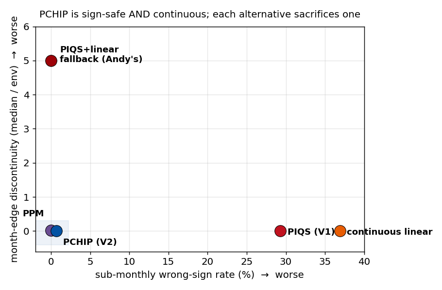
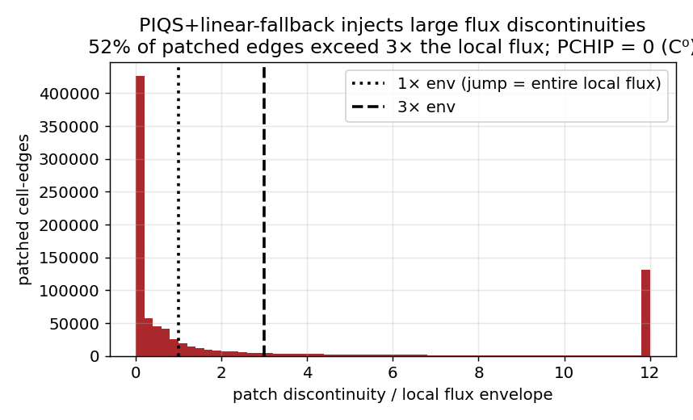

# V1 → V2: a justification for every change

**Status:** decision / review document · **Date:** 2026-06-21 · **Purpose:** a
single auditable register that defends *every* change from the V1 (legacy)
processing pipeline to V2 (`main`, tagged `v2.0.0`). For any change a reviewer
questions, this document gives the rationale, the quantified impact, and the
verification that backs it. Deep-dive analyses live in
[FITTER_COMPARISON.md](FITTER_COMPARISON.md) and
[DIURNALIZATION_ALTERNATIVES.md](DIURNALIZATION_ALTERNATIVES.md); the engineering
log lives in [CHANGELOG.md](../CHANGELOG.md) and the conceptual reasoning in
[PROPOSALS.md](PROPOSALS.md). This file ties them together and makes the
defensibility explicit.

## 0. How to read this — two categories and one invariant

Every change is exactly one of:

- **(B) Behavior-preserving** — the output product is *provably unchanged*:
  bit-identical (`ncdiff` max |Δ| = 0), an exact-equivalent algorithm (matched to
  floating point), or purely additive metadata / observability / packaging.
  These need no *scientific* defense because they move no number the science
  sees; the defense is the verification that proves it (§4).
- **(A) Intentional improvement** — output numbers *do* change. Each carries:
  what V1 did and why it was worse, what V2 does, the quantified impact, why the
  new behavior is correct (physics / statistics / citation), the verification
  guarding it, and the residual risk (§1–§3).

**The master invariant (why the headline change is safe).** Every fitter in the
tree is **integral-preserving by construction**: each month's per-piece integral
equals that month's MiCASA mean. Therefore *the monthly-and-longer carbon budget
— annual totals, the long-term trend, interannual variability, the ENSO and
COVID signals — is identical across any two fitters* **at the fit level**. Two
scope caveats, stated up front rather than in fine print:
- This is a property of the *fitter*. The **shipped** hourly NEE additionally
  applies a polar-night clip (§3.2) that zeros GPP in dark hours and so opens a
  **≤1.5% high-latitude mass gap** in the product — a property of the clip, not
  the fitter, and identical PIQS↔PCHIP. So "mass-preserving" is exact for the
  fit and ≤1.5%-approximate for the delivered product at high latitudes.
- Mass-preservation is exact; **sign-preservation is not** (see §1, claim 2) —
  the two are independent.

The fitter can only change the **sub-monthly shape**. This is verified two ways:
verify_v2 Check 2.1 (per-piece integral preservation to max-abs < 1e-9, max-rel
< 1e-6), and the Section-15 climate-signal checks being **unchanged** PIQS↔PCHIP
(trend +0.0447 PgC/yr/yr, 2015-16 El Niño +0.643, 2020 COVID −0.346; **reproduced** by the
2026-06-21 verify_v2 re-run, identical to the original 2026-05-04 values, see §6). So the change Andy flagged does not
move the science signal — it changes the sub-monthly shape, removing most of an
unphysical artifact.

**Standing evidence base.** Two independent harnesses back the claims below:
- `verify_v2` — **60 distinct checks across 24 sections** (enumerated in §6); the
  harness was **re-run for this revision on 2026-06-21** (job 23239358;
  `fitter_diagnostics/verify_v2_summary_20260621.txt`): 51 PASS / 1 WARN / 9 INFO,
  plus one FAIL on Check 24.1 (run-manifest integrity) caused by concurrent-append
  corruption of the shared TSV log by *this session's* parallel diagnostic jobs (a
  logging artifact — Check 24.2 "no failed steps" passed; the malformed rows were
  cleaned). Every science/product check passes and **reproduces** the numbers used
  below.
- `tests/` — **143 R checks run on any host (10 files) + 10 `quadprog`-gated
  (`test_mss_fit.r`, Orion only) = 153**, plus 4 Python suites; **all green** on
  Orion (R 4.4.0, 2026-06-21). The 143 non-gated R checks were reproduced green
  locally (R 4.6.0) for this revision. Per-change → test map in §6.

---

## 1. Headline change — fitter PIQS → PCHIP (A)

This is the change that prompted the V1↔V2 concern, so it gets the fullest
defense. Full bake-off (PPM / minmod / MSS / ATP / PIQS) in
[FITTER_COMPARISON.md](FITTER_COMPARISON.md).

**V1 — PIQS** (Piecewise Integral Quadratic Splines, Rasmussen 1991;
CT2022-documented). Per-cell quadratic pieces, each preserving the monthly
integral, C⁰ at knots. Two disqualifying problems for an NRT product:
1. **Overshoot → unphysical sign flips.** In sharply seasonal cells the quadratic
   overshoots through zero, producing positive (source) GPP and negative
   respiration sub-monthly. Measured rate (Check 3.1): **6.55%** of GPP
   cell-hours mean, **14.70%** max; Rh 0.122% / 0.444%.
2. **Non-locality.** PIQS is a single global solve over the entire record, so any
   NRT revision **rewrites all 302 historical months** — the published past
   changes every cycle.

**V2 — PCHIP-on-cumulative** (Fritsch & Carlson 1980; `splinefun(method="monoH.FC")`
/ `scipy PchipInterpolator`). Monotone-cubic Hermite interpolation of the
cumulative integral F(t), differentiated analytically to the flux f = F′ as a
piecewise quadratic (same `(a,b,c)` storage as PIQS).

**Claims, stated to their exact scope:**
1. **Budget-invariant at the fit level** — monthly+ means identical by
   construction (each piece's integral = the monthly mean; mass-preserving). The
   climate signal is therefore fitter-invariant (master invariant above; Check
   2.1, Section 15). Globals unchanged: GPP ∈ [−126.2, −119.8], resp ∈
   [117.0, 123.9] PgC/yr (Check 5.1; reproduced 2026-06-21).
2. **A large sub-monthly improvement — a ~16–57× reduction in sign flips, *not*
   elimination by construction.** PCHIP fits a Fritsch-Carlson *monotone* cubic to
   the cumulative integral, so the flux f = F′ is sign-definite **at the knots**
   and overwhelmingly so in the interiors. It is **not** sign-definite *everywhere*
   by construction: Fritsch-Carlson constrains the cubic's *knot* slopes, and the
   derivative quadratic can still dip mid-segment even on strictly single-signed
   input. We reproduced this — worst interior flux **−0.042 on strictly positive
   monthly means** (≈2% of the median), see
   [`fitter_diagnostics/pchip_sign_definiteness.r`](../fitter_diagnostics/pchip_sign_definiteness.r).
   What PCHIP buys is a 1–2 order-of-magnitude *reduction* vs PIQS, leaving a small
   bounded residual: GPP **6.55% → 0.11%** mean (~60×), 14.70% → **0.94%** max
   (16×); Rh 0.122% → 0.0000% mean, 0.444% → 0.002% max (Check 3.1, 2026-06-21
   re-run). Check 18.2 confirms C¹ continuity (|jump| ≤ 1e-12). Check 18.1 (INFO)
   independently finds **0.646% of GPP *segments*** carry a wrong-sign interior
   point (max 1.24e-6) — fresh confirmation the residual is real and that
   "sign-definite everywhere" would be false.
3. **Reduction is rule-based, not tuned** — the knot-level sign-definiteness and
   the interior reduction come from the Fritsch-Carlson monotonicity rule, not a
   fitted parameter; the small residual interior dips (and any dark-hour GPP) are
   then removed by the polar-night clip (§3.2). PIQS's overshoot, by contrast, was
   an order of magnitude larger and *not* removable without a clip that would
   distort the bulk flux.
4. **NRT-local** — Fritsch-Carlson slopes use only neighbouring monthly means, so
   a revision's footprint is ~1 month, vs PIQS rewriting the whole record. This is
   a correctness requirement for a published NRT product, independent of the
   physics. (Locality follows from the slope formula; it is argued, not separately
   diff-tested.)

**Verification:** Checks 2.1, 3.1, 6.1, 18.1, 18.2; `tests/test_pchip_fit.r`
(12 checks, green); `bakeoff_pchip.py` (6 biome cells: 0% flips *on those cells*
vs PIQS up to 30.91% — the full-grid residual is the ≤0.94% in claim 2, |Δ flux| < 2e-11).

**Selectable alternatives** (not defaults): PPM, minmod/MUSCL, ATP-kriging, MSS,
PIQS all remain selectable via `MICASA_FIT_RDA`; PPM was briefly defaulted then
reverted (continuity — see §5). The on-disk format and all monthly+ budgets are
identical across them.

---

## 2. Diurnalization — framework unchanged; refinements staged but not yet shipped

**The production diurnal scheme is V1's, unchanged.** GPP ∝ ERA5 shortwave,
respiration ∝ Q10(2-m air temp) — Olsen & Randerson (2004). There is **no V1→V2
change to the default diurnal cycle**, so nothing here needs defending against V1.

The soil-temperature driver and Lloyd-Taylor response documented in
[DIURNALIZATION_ALTERNATIVES.md](DIURNALIZATION_ALTERNATIVES.md) are **default-off,
opt-in** (`MICASA_RESP_DRIVER`, `MICASA_RESP_TEMPFUN`) and **byte-identical to
the canonical product when off** — verified by a committed `ncdiff` run
([`fitter_diagnostics/bytecheck_resp_driver_default.txt`](../fitter_diagnostics/bytecheck_resp_driver_default.txt):
max |Δ| = 0 for GPP/resp/NEE, new default-path code vs the canonical
`ERA5_2020_pchip/fluxes_202007.nc`), run-and-diffed, not argued from source. They
are evidence-backed *candidates*, not shipped
changes; defaults will not move until validated against eddy-covariance diurnal
amplitudes. So they impose zero risk on the current product while making the next
step defensible. (Measured effect when enabled: soil-temp NEE diurnal amplitude
+2% global, ×0.5 boreal winter; Lloyd-Taylor respiration ×1.5 global — see that
doc §5.1–5.3.)

**Recommendation (new, with CIs + forcing validation):** the soil-temperature
driver is now **recommended as the default**. Its respiration damping is validated
as a *real ERA5 forcing property* — the driver's own `stl1`/`t2m` per-cell
amplitude ratio (0.860, July) matches the respiration ratio (0.862) to within
0.002 — the NEE effect is small and sign-correct (amplitude ratio **1.022, 95% CI
[1.022, 1.023]**, by-cell bootstrap), and it costs nothing (`stl1` already loaded,
mass conserved, default-off byte-identical). The production default has **not**
been flipped pending sign-off; Lloyd-Taylor stays opt-in. Full justification +
figures: DIURNALIZATION_ALTERNATIVES.md §5.4.

---

## 3. Other product-number changes (A) — each justified

### 3.1 Aggregation latitude-weight bug fix — V1 was wrong, V2 is correct
V1's 0.1°→1° aggregator (`lib/ingest_common.r:aggregate.to.1x1`) recycled the
cos-latitude area weights **column-major**, applying them along the *longitude*
axis instead of latitude (with a dead ×10/÷10 inner loop). V2 builds a flat
length-100 weight vector that assigns each sub-cell its correct latitude weight.
This is a **genuine bug**: V1 area-weighted the wrong axis. Impact is small for
smooth fields (typically < 0.01%) and grows toward the poles where the cos-lat
gradient across a 1° block is largest. **Verification:** `tests/test_aggregate.r`
(regression test) pins the corrected weighting against the analytic spherical
area; `lib/test_ingest_bitident.r` confirms the read path. Justification is not
"we prefer V2" but "V1 mis-weighted; V2 matches the analytic cos-lat area."

### 3.2 Polar-night GPP = 0 clip
Physical: no incoming shortwave ⇒ no photosynthesis. The clip zeros GPP wherever
`ssrd == 0`, removing the small residual the sub-monthly quadratic otherwise
leaks into dark hours (~2.6% of cells in `fluxes_202512.nc`, max |GPP| =
9.4e-9 mol m⁻² s⁻¹). Cost: a ~1.5% mass-conservation gap at partial-polar-night
latitudes (Check 2.2 threshold relaxed 1% → 5% to acknowledge it) — this gap is
the reason the shipped product is not exactly mass-preserving (§0). Under PCHIP
this clip is now **largely redundant** — the fit's residual interior dips are
small (≤0.94% of GPP cell-hours, §1), so the clip's remaining effect is minor —
but kept as defense-in-depth. **Verification:** Checks 12.2, 17.1.

### 3.3 ERA5 dual-tree FastTrack fallback
Only affects NRT trailing months the primary ERA5 tree has not yet populated;
those days fall to the lower-latency `ea_0005` FastTrack stream (the *same* ERA5
product, earlier release). For any month the primary covers, the path is
unchanged. Per-day provenance is written (`meteo_source_by_day`, e.g.
`primary:1-30 fasttrack:31`). **Verification:** Checks 1.4, 10.1; first
production use 2026-Q1 (2026-02/03 wholly FastTrack), clean files.

### 3.4 Per-month climatology auto-detect
V1 chose real-vs-climatology per *year* from a hand-set `MICASA_CLIM_YEARS` list,
with no file-existence check — a partially-published year forced either
climatologising real months or crashing on unpublished ones. V2 decides per
*month* by file presence: real monthly file present ⇒ use it, else day-of-year
climatology. For fully-published months the path is identical. **Verification:**
Check 1.4; 2026-Q1 run (Jan–Mar real via PCHIP, later months climatology, no
crash).

---

## 4. Behavior-preserving changes (B) — proven no-ops on the product

Each item below changes *no flux value*; the proof is in the right column.

| Change | Proof it preserves the product |
|---|---|
| `diurnal.flux` / `polar.night.clip` extracted to `lib/diurnal.r` | Byte-for-byte identical on random arrays; `tests/test_diurnal.r` (21) |
| Fitter cores extracted to `lib/{pchip,mss,ppm,linmm}_fit.r` | Function bodies unchanged; unit tests `test_{pchip,mss,ppm,linmm}_fit.r` (12/10/13/11) |
| ERA5 path helpers → `lib/era5_meteo.r` | `tests/test_era5_meteo.r` (11) on resolver + run-length encoder |
| Grid-area fns `archimedes`/`compute.gca` made pure | `tests/test_ingest_geometry.r` (20) vs analytic 4πR² |
| `compute_clim` PyFerret → xarray | Algorithm exact to 1e-12 vs hand-computed mean; `tests/test_compute_clim.py` |
| `check_bounds` NCO `ncwa` → xarray | Pure `flux_to_tgc_per_year`; `tests/test_check_bounds.py` (7). NCO version never actually ran (guarded by `|| true`). |
| Ingest skip-existing + read-only-needed | `ncdiff` 4 days × 4 tracers max \|Δ\| = 0; `lib/test_ingest_bitident.r`; 610→504→4 s |
| Compression deflate 9 → 4 (**diurnalize output only**; ingest stays at 9, `lib/ingest_common.r:149`) | Lossless codec ⇒ data bit-identical; only size +0.3% / time −39% (`lib/bench_compression_diurnal.r`). Codec argument, not ncdiff-run. |
| Provenance CF/ACDD attributes | Additive global attributes only; `tests/test_provenance.{r,py}` (26 ea); Checks 23.1–23.3 |
| Per-step run manifest | Additive `jobs/run_manifest.tsv`; never aborts caller; `tests/test_manifest.r` (15); Checks 22.1, 24.1–24.2 |
| Sub-monthly sign-flip logging | Log lines only; drives Check 3.1; no flux touched |
| Download verify scoped to year | Verifies *which* files, not their content; same files for a given year |
| Op bug fixes: `sbatch_wait` comma, `check_hashes` glob, `compute_daily_clim` nullglob, hardcoded paths | Fix crashes/skips, not numbers; `tests/test_check_hashes.py` (12); 2026-Q1 multi-scenario run |
| verify_v2 harness edits (6.2→INFO, 11.1 log-age, 5.1/5.2 partial-year, 1.4 dual-tree) | Change what is *checked*, not what is *produced*; each justified in CHANGELOG 2026-05-16 |
| Public-release packaging (LICENSE CC0, README split, CITATION.cff, CI) | No pipeline effect |

The CI (`.github/workflows/ci.yml`) byte-compiles Python, `bash -n`s every shell
script, `parse()`s every R script, and runs the behavior tests on every push — so
these refactors cannot silently regress.

---

## 5. Considered and rejected (diligence, not changes)

Documenting what was *not* changed, and why, is part of the justification:

- **ATMC budget closure** — tried 2026-04-29, reverted same day. Subtracting the
  LoFI ATMC sink double-dips: it is tuned to the atmospheric CO₂ growth rate, the
  very signal the downstream inversion assimilates (METHODOLOGY.md; PROPOSALS #7).
  Trend impact had it stayed: +0.0413 → −0.0067 PgC/yr/yr. (Note: this **+0.0413**
  is the *PIQS-era* CASA-only trend from the 2026-04-29 ATMC-comparison table; the
  **+0.0447** quoted in §0/§1 is the later *PCHIP* Section-15 value from the
  2026-05-04 run, and **+0.04** in §7/METHODOLOGY is the same figure rounded. They
  are consistent — different runs of the same ~+0.04 PgC/yr/yr CASA-only trend.)
- **PPM as default** — briefly defaulted 2026-06-18, reverted: daily fidelity is a
  statistical tie with PCHIP (PPM better in 54% of cell-months) but PPM
  reintroduces month-edge discontinuities at ~70% of edges (CHANGELOG 2026-06-18).
- **MSS** (overshoots despite the name, ~24% wrong-sign GPP knots, ~hours/grid),
  **linear-recursion PIQS** (unstable), **constrained-quadratic PIQS** (dominated
  by PCHIP), **CCGCRV** (not pursued) — FITTER_COMPARISON.md §4.1/§5, PROPOSALS
  #9/#11/#6.

---

### 5.1 Why not "PIQS, then revert to linear on overshoot"

This hybrid — keep PIQS's smooth global-solve quadratic where it is sign-safe and
patch the overshooting pieces with a sign-safe integral-preserving linear — was a
stakeholder-preferred alternative to PCHIP. It was implemented and measured
(`fitter_diagnostics/piqs_hybrid.r`, `linear_fallback_quantify.r`) and **not
adopted**, on four quantified grounds:

1. **Non-locality is not fixed.** The linear fallback is applied *post-hoc* to
   PIQS's already-solved coefficients; it does not decouple the knots. A revised
   NRT month still re-solves PIQS and **rewrites all 302 historical months**
   (footprint table, FITTER_COMPARISON §4) — the exact disqualifier PCHIP avoids
   (footprint 0).
2. **It trades bounded overshoot for large discontinuities.** **29.3%** of land
   cell-months trigger the fallback, and patching breaks PIQS's C⁰ continuity at
   those edges: **52% of patched edges jump more than 3× the local flux envelope,
   and 38% jump more than the *entire* local monthly flux** (the overshooting
   cells are near-zero transition months, so the patch sits far from its
   neighbour; median ~5× env). PCHIP's edge discontinuity is exactly **0**.
3. **"Just use linear everywhere" is *worse* than PIQS.** The continuous
   integral-preserving linear recursion `y_{i+1}=2·mᵢ−yᵢ` flips sign at **36.9%
   of interior knots** (vs PIQS's 29.3% overshoot) and rings with **unbounded
   resonance** (knot/env amplification p99 = 2.6×10⁵ — the Nyquist pole of
   PROPOSALS #9): it forces the month-to-month alternation that PIQS's quadratic
   absorbs into curvature onto the knots instead.
4. **No fidelity gain.** Hybrid daily RMSE/env (2020) is **0.079 / 0.139**, tying
   PCHIP's **0.081 / 0.141** — the preserved smoothness buys no reconstruction
   accuracy.

PCHIP dominates the whole tradeoff — sign-safe *and* C⁰-continuous *and* local
*and* closed-form — the "good corner" below:

## 6. Evidence matrix

**Validation harness — `verify_v2` (60 distinct checks / 24 sections).** Phase 1
structural (1.1–1.4); Phase 2 transformation + sanity (2.1–2.4 mass/integral,
5.1–5.3 global/YoY/seasonal); Phase 3 cross-boundary + spatial-vs-v1 + provenance
(4.1, 6.1–6.2, 7.1–7.4, 8.1–8.3, 9.1–9.2, 10.1, 11.1–11.2); Phase 4 edge cases +
biome cells + trends (12.1–12.2, 13.1–13.2, 14.1–14.3, 15.1–15.3 trend/ENSO/COVID,
16.x diagnostics); Sections 17 diurnal integrity, 18 PCHIP invariants, 19
additional biomes, 20 cross-product, 21 robustness, 22 performance, 23 provenance,
24 manifest. The **2026-06-21 re-run** summary is committed at
`fitter_diagnostics/verify_v2_summary_20260621.txt` (51 PASS / 1 WARN / 9 INFO;
the lone 24.1 manifest FAIL was a concurrent-append log artifact, since cleaned).

**Unit tests — all green on Orion (R 4.4.0 / Python, 2026-06-21); the 143
non-`quadprog` R checks reproduced green locally (R 4.6.0) for this revision:**

| Suite | Checks | Guards |
|---|---|---|
| test_pchip_fit.r | 12 | PCHIP mass / C¹ / sign-flip-rate (not sign-definiteness — see §1) |
| test_diurnal.r | 21 | diurnalize transform + q10/lt factors |
| test_atpk_fit.r | 14 | ATP coherence/variance/sign |
| test_ppm_fit.r / test_linmm_fit.r | 13 / 11 | PPM & minmod mass/limiter |
| test_mss_fit.r | 10 | MSS QP fit — **requires `quadprog`; runs on Orion, SKIPs without it** |
| test_ingest_geometry.r | 20 | spherical area weights |
| test_era5_meteo.r | 11 | FastTrack resolver |
| test_manifest.r | 15 | manifest format / no-abort |
| test_provenance.r / .py | 26 / 26 | CF/ACDD attributes |
| test_check_hashes.py / test_check_bounds.py / test_compute_clim.py | 12 / 7 / 10 | hashing / unit conv / clim mean |

R total: 143 host-portable + 10 `quadprog`-gated (MSS) = 153.

**Per-change → guard map** (numbers-changing items): fitter → 2.1, 3.1, 18.1,
18.2 + test_pchip_fit; polar-night → 12.2, 17.1; aggregation fix → test_aggregate
+ test_ingest_bitident; FastTrack → 1.4, 10.1; per-month clim → 1.4. Every
behavior-preserving item maps to a proof in the §4 table.

---

## 7. Known residual limitations (stated, not hidden)

- **+0.04 PgC/yr/yr** long-term trend in CASA-only NEE is accepted as a real
  feature of the prior — by design the inversion corrects it (we do *not*
  pre-close it with ATMC; §5, METHODOLOGY.md).
- **Polar-night clip** leaves a ~1.5% mass gap at partial-polar-night latitudes
  (Check 2.2 at 5%) — so the *shipped* product is not exactly mass-preserving
  there (§0/§3.2). Largely (not fully) redundant under PCHIP; kept defensively.
- **PCHIP is not sign-definite everywhere** — it cuts sub-monthly sign flips
  16–57× vs PIQS but leaves a small bounded residual (≤0.94% of GPP cell-hours;
  reproduced in `fitter_diagnostics/pchip_sign_definiteness.r`), mopped up by the
  clip. "Eliminated by construction" would be an overstatement (§1).
- **Diurnal respiration refinements** (soil-temp, Lloyd-Taylor) are implemented
  and opt-in but **not yet validated against eddy-covariance** diurnal amplitudes
  — the gate before any default flip (DIURNALIZATION_ALTERNATIVES.md §5.3).
- **Archival DOI** ships as `PENDING` (`grep -rl PENDING` finds every spot).
